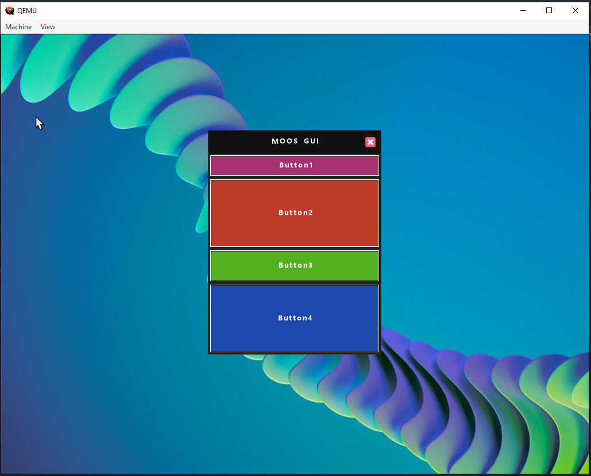

# MOOS IU XAML

##HOW USE
>use MOOS from directory MOOS/build for test

# CONTROLS
- [x] Window
- [x] Button
- [x] Grid

# FEATURES
- [x] Command
- [x] Margin
- [x] Background
- [x] Foreground
- [x] Grid.Row
- [x] BorderBrush
- [x] BorderThickness
- [ ] Grid.Column
