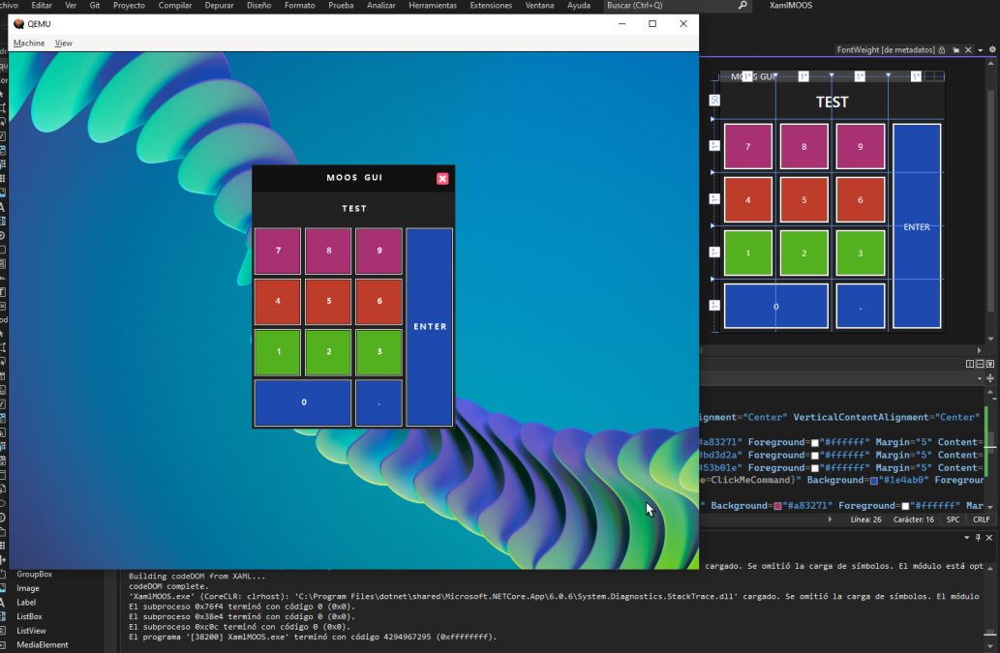

# MOOS UI XAML

## FEATURES

### Controls
- [x] Window
- [x] Button
- [x] Label
- [x] TextBox
- [x] Grid

### Properties
- [x] Margin
- [x] Background
- [x] Foreground
- [x] BorderBrush
- [x] BorderThickness

### Buttons Events
- [x] Command
- [x] CommandParameter

### Grids
- [x] Grid.Row
- [x] Grid.Column
- [x] Grid.RowSpan
- [x] Grid.ColumnSpan
- [ ] Grid SubGrids

### Fonts
- [ ] FontSize
- [x] Foreground
- [ ] FontWeight

## How to use
>How to use MOOS from `MOOS/build` for testing
